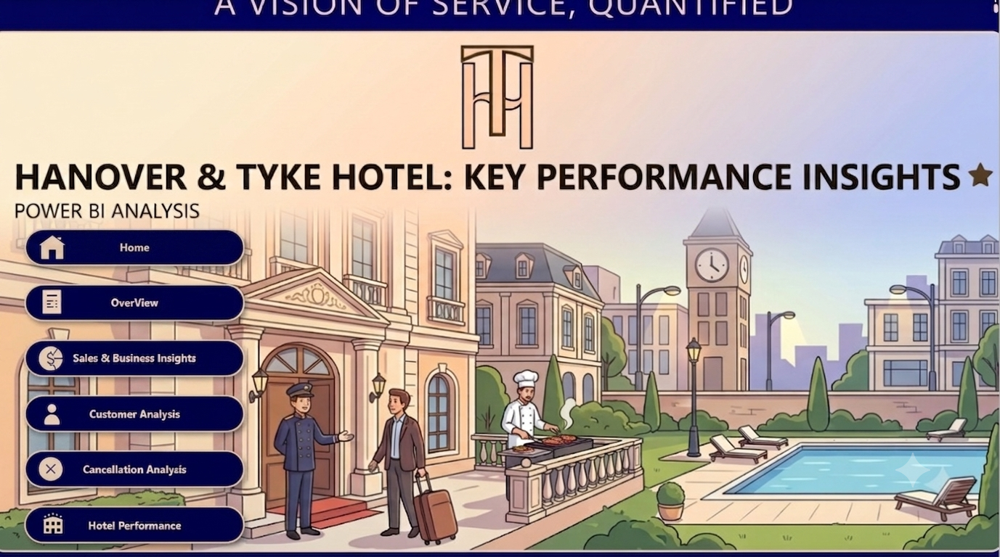
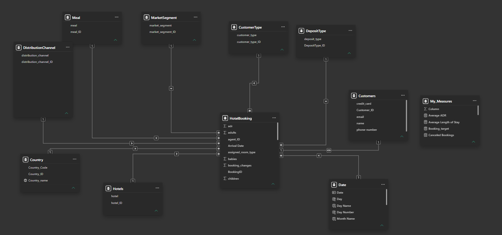
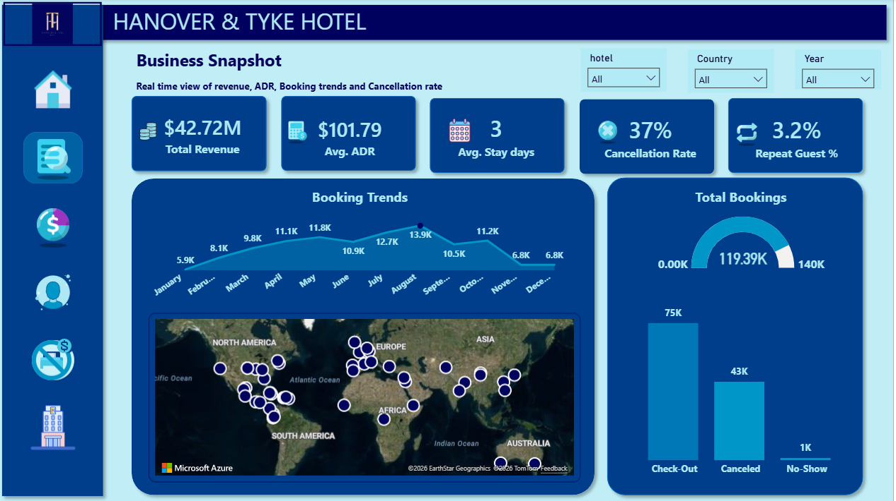
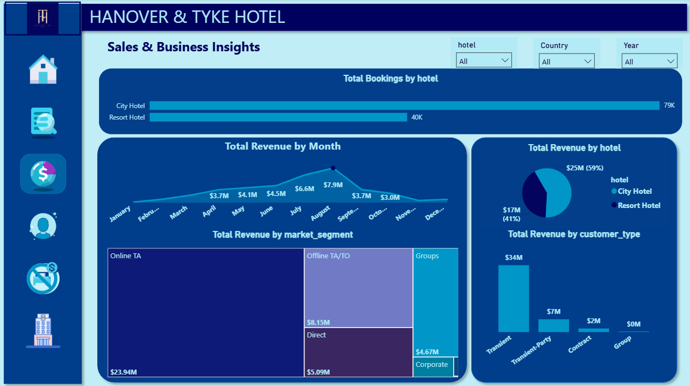
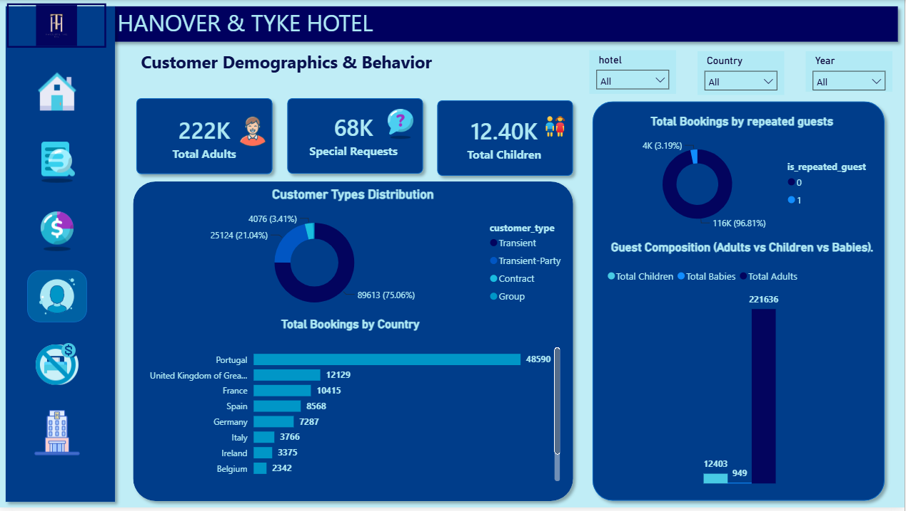
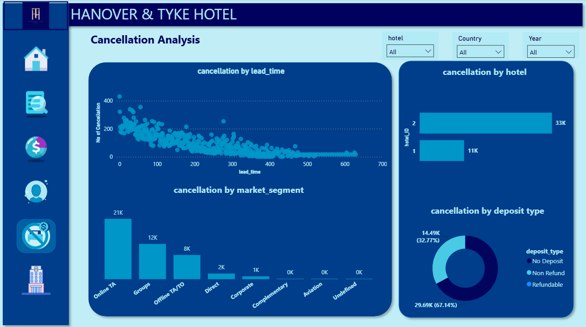
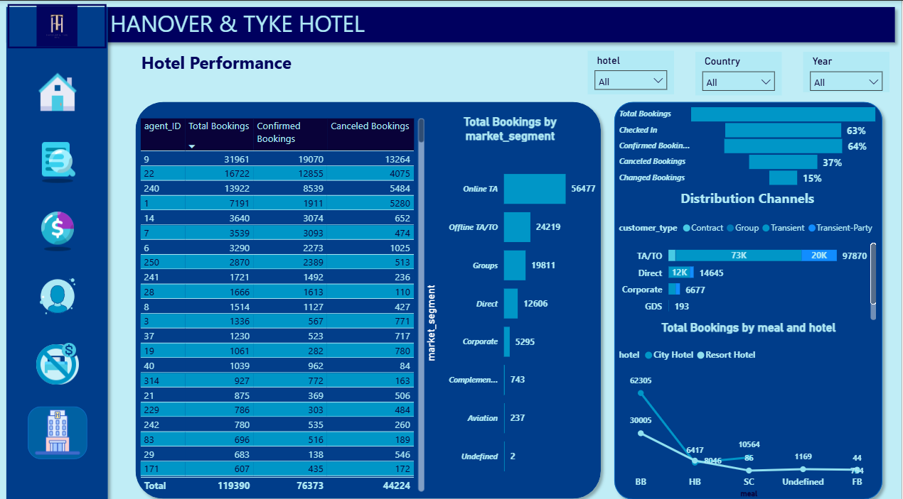

# 🏨 Hotel Booking Performance Analysis — Power BI

  
  
  

> A Power BI business intelligence project analyzing hotel booking performance, revenue, customer behavior, cancellations, distribution channels, and operational performance to translate booking data into actionable business recommendations.

## 📌 Project Overview

This project transforms hotel booking data into an interactive Power BI reporting solution designed to support business and operational decision-making.

The analysis covers revenue and booking performance, cancellation behavior, customer demographics, distribution channels, hotel performance, agent performance, meal-plan preferences, and seasonality.

The project demonstrates an end-to-end analytics workflow including **data ingestion, SQL Server integration, data cleaning, validation, dimensional modeling, DAX measure development, dashboard design, insight generation, and stakeholder-focused storytelling**.

  

## 🎯 Business Objectives

- Monitor overall booking and revenue performance.
- Understand booking seasonality and demand patterns.
- Measure cancellation levels and identify cancellation drivers.
- Analyze customer demographics and booking behavior.
- Compare City Hotel and Resort Hotel performance.
- Evaluate distribution channels and booking sources.
- Identify high-volume and high-risk agents.
- Understand guest meal-plan preferences.
- Translate analytical findings into practical business recommendations.

## 🔄 Data & Analytics Workflow

The project uses **SQL Server as the data source between the raw dataset and Power BI**.

1. The original CSV dataset was imported into **SQL Server**.
2. SQL Server was used to manage the data source and support the required queries efficiently.
3. **Power BI was connected directly to SQL Server** rather than working from the raw CSV file.
4. The data was cleaned, validated, and prepared for analysis.
5. A normalized **Star Schema** was created in Power BI.
6. DAX measures were developed for the business KPIs and analytical requirements.
7. Interactive dashboards were built in Power BI for stakeholder reporting and decision-making.

This workflow provided a more structured data pipeline and helped the model and queries work more efficiently and reliably as part of the reporting solution.

## 📊 Key Business Findings

| KPI / Finding | Result |
|---|---:|
| Total Revenue | **$42.72M** |
| Average Daily Rate (ADR) | **$101.79** |
| Cancellation Rate | **37%** |
| Repeat Guest Rate | **3.2%** |
| Peak Booking Month | **August — 13.9K bookings** |
| City Hotel Bookings | **79K** |
| Resort Hotel Bookings | **40K** |
| OTA Revenue | **$23.94M** |
| Direct Booking Revenue | **$5.09M** |
| Top Country | **Portugal — 48,590 bookings** |

## 🧹 Data Cleaning & Validation

The project included a structured data-quality process before analysis:

- Replaced missing values in the `children` column with `0`.
- Converted `agent` and `company` identifiers from numeric to text.
- Identified and corrected an ADR outlier from **5400 to 540** after validation with the data manager.
- Replaced missing agent values with **Agent ID 22** based on business confirmation.
- Checked for remaining null values, invalid values, inconsistencies, and incorrect data types.

## 🏗️ Data Modeling

The original dataset was normalized into a **Star Schema** to improve organization and support efficient analytical reporting.

  

### Fact Table

- `HotelBooking`

### Dimension Tables

- `Date`
- `Country`
- `Hotels`
- `Meal`
- `MarketSegment`
- `DistributionChannel`
- `CustomerType`
- `DepositType`
- `Customers`

The dimension tables connect to the `HotelBooking` fact table through one-to-many relationships. A dedicated Date dimension supports year, quarter, month, week, day, and weekday/weekend analysis.

## 📐 DAX Measures

The model includes measures for key business metrics, including:

- Average ADR
- Average Length of Stay
- Total Bookings
- Canceled Bookings
- Cancellation Rate
- Confirmed Bookings
- Checked In
- Changed Bookings
- Repeat Guests
- Repeat Guest %
- Total Adults / Children / Babies
- Total Nights
- Total Revenue
- Total Special Requests

## 🔍 Key Insights & Recommendations

### Business Snapshot

  

The hotel generated **$42.72M** in revenue with an ADR of **$101.79**. The **37% cancellation rate** represents a major source of revenue leakage, while only **3.2%** of guests are repeat customers. Demand is strongly seasonal, peaking in August at approximately **13.9K bookings**.

**Recommendations:** strengthen loyalty initiatives and use targeted winter campaigns, corporate packages, and seasonal promotions to reduce demand dips.

### Sales & Business Performance

  

City Hotel generated approximately **79K bookings and $25M revenue**, compared with **40K bookings and $17M revenue** for Resort Hotel. OTAs generated approximately **$23.94M**, substantially more than direct bookings at **$5.09M**.

**Recommendations:** increase direct-booking share through incentives and optimize pricing during high-demand periods.

### Customer Demographics & Behavior

  

Portugal is the dominant market with **48,590 bookings**, followed by the UK with **12,129**. Adults account for the vast majority of guests, while Transient customers represent **75.06%** of the customer mix.

**Recommendations:** focus localized marketing on major markets and tailor positioning toward couples, solo travelers, and business professionals.

### Cancellation Analysis

  

**67.14%** of cancellations are associated with `No Deposit` bookings. OTAs generate the highest cancellation volume, and Hotel 2 experiences approximately three times the cancellation volume of Hotel 1.

**Recommendations:** review deposit policies, investigate non-refundable cancellation behavior, and consider data-driven overbooking strategies for high-risk segments.

### Hotel Performance

  

Agent ID 9 generated **31,961 bookings** but also had **13,264 cancellations**. Bed & Breakfast is the dominant meal plan across both hotels, while approximately **37%** of top-of-funnel bookings are lost to cancellations.

**Recommendations:** evaluate agent traffic quality, reward completed stays rather than raw booking volume, and use pre-arrival upselling to encourage meal-plan upgrades.

## 🛠️ Tools & Skills

- **SQL Server** — Data ingestion, data-source management, and query layer
- **Power BI** — Dashboard development and business intelligence
- **Power Query** — Data cleaning and transformation
- **DAX** — Analytical measures and KPIs
- **Star Schema** — Dimensional data modeling
- **Data Quality & Validation** — Null, type, consistency, and outlier checks
- **Data Visualization** — Interactive business dashboards
- **Data Storytelling** — Stakeholder-focused reporting
- **Business Analysis** — Translating findings into strategic recommendations

## 📚 Documentation

The detailed project documentation covers data cleaning, validation, dimensional modeling, DAX measures, dashboard analysis, insights, and recommendations.

📄 **[View Project Documentation](Documentation/Documentation.pdf)**

## 🎤 Stakeholder Presentation

The presentation summarizes the analytical process, dashboard findings, business insights, and recommendations in a stakeholder-ready format.

📊 **[View Stakeholder Presentation](Presentation/Hanover_Tyke.pptx)**

## 📊 Power BI Dashboard

The complete interactive Power BI report will be available in the `PowerBI/` directory. Power BI Desktop is required to open the `.pbix` file.

## 👤 About Me

**Eslam Ashraf** — Data Analyst focused on transforming data into actionable business insights.

**Skills:** Power BI • DAX • SQL Server • Excel • Python • Data Visualization • Data Analysis

### ⭐ If you find this project useful, consider starring the repository!
